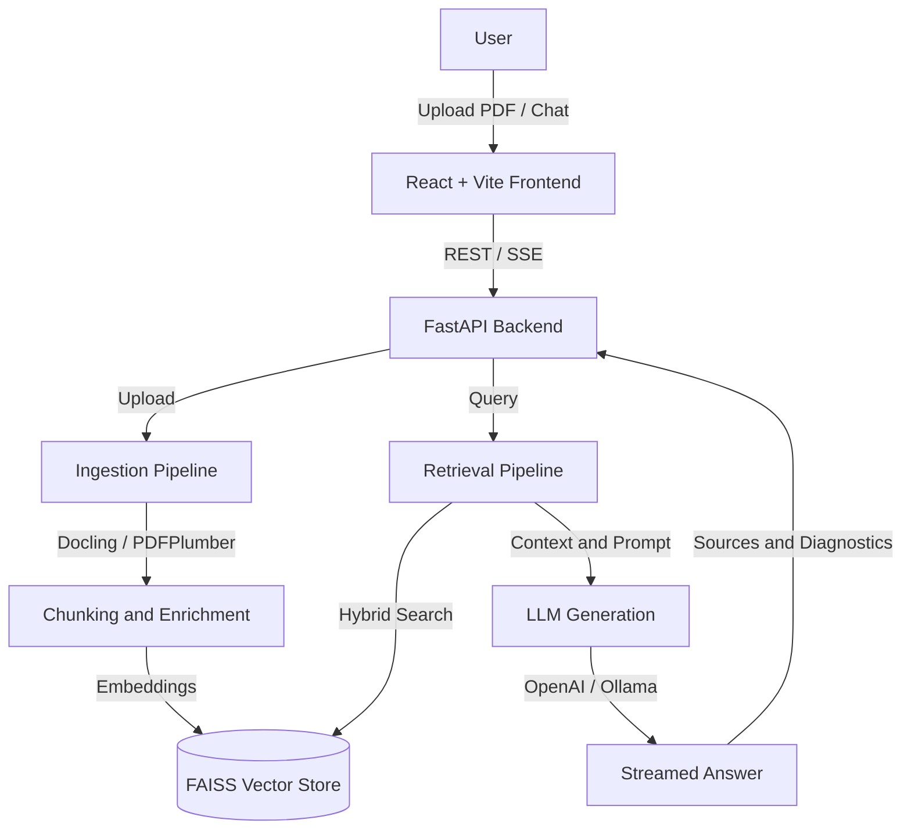

# RAGiT (RAG Assistant)

Retrieval-Augmented Generation assistant for local knowledge bases. It lets you upload PDFs, index their contents, ask grounded questions, stream responses, and inspect retrieved source context.

## Features

- Multi-file PDF upload with duplicate detection.
- Safer upload handling with simple filename validation, PDF byte checks, and configurable upload size limits.
- Hybrid retrieval over FAISS-backed vectors plus lexical/BM25-style signals.
- Optional neural reranking with FlagEmbedding.
- Local-first generation through Ollama, with optional OpenAI generation.
- Server-Sent Events (SSE) streaming for chat responses.
- Source references, confidence diagnostics, and optional post-generation verification.
- React + Vite frontend for upload, chat, reset, and retrieved-context review.
- Optional API-key protection for backend routes.

## Architecture



## Tech Stack

- Backend: FastAPI, LangChain, FAISS, pdfplumber, Docling
- AI/models: Ollama, OpenAI, HuggingFace sentence-transformers
- Frontend: React, TypeScript, Vite
- Storage: local filesystem uploads and FAISS index persistence

## Backend Setup

From the repository root:

```powershell
python -m venv .venv
.\.venv\Scripts\Activate.ps1
python -m pip install --upgrade pip
python -m pip install -r .\backend\requirements.txt
Copy-Item .\backend\.env.example .\backend\.env
```

Edit `backend/.env` for your local models and keys, then start the API:

```powershell
cd .\backend
python -m uvicorn app.main:app --reload --port 8000
```

## Frontend Setup

In a separate terminal:

```powershell
cd .\frontend
npm install
npm run dev
```

The frontend defaults to `http://localhost:8000` for the API and runs at `http://localhost:5173/`.

## API Key Setup

For local development, `APP_API_KEY` can be left empty.

For production-like usage:

```env
APP_ENV=production
APP_API_KEY=replace-with-a-long-random-secret
ALLOWED_CORS_ORIGINS=https://your-frontend.example.com
```

Set the same value in the frontend environment:

```env
VITE_API_KEY=replace-with-a-long-random-secret
```

When `APP_ENV=production`, the backend fails startup if `APP_API_KEY` is empty.

## Important Configuration

| Variable | Description |
|---|---|
| `APP_ENV` | `development` or `production`. Production requires `APP_API_KEY`. |
| `APP_API_KEY` | Optional local API key; required in production. |
| `ALLOWED_CORS_ORIGINS` | Comma-separated frontend origins allowed by CORS. |
| `MAX_UPLOAD_SIZE_MB` | Maximum PDF upload size handled by the app. |
| `EMBEDDING_MODEL` | Local sentence-transformers embedding model. |
| `EMBEDDING_DEVICE` | CPU-only for this project. Keep this as `cpu`. |
| `USE_OPENAI` | Route generation through OpenAI when enabled. |
| `OPENAI_API_KEY` | OpenAI key for generation, summaries, or vision enrichment. |
| `LOCAL_LLM_ENDPOINT` | Ollama generation endpoint. |
| `LOCAL_LLM_MODEL` | Ollama model tag for local generation. |
| `ENABLE_NEURAL_RERANKER` | Enables cross-encoder reranking. |
| `ENABLE_VERIFICATION` | Enables lightweight post-generation verification. |

## API Endpoints

- `GET /health` - public health check.
- `POST /upload` - ingest one or more PDF documents.
- `GET /knowledge-base/files` - list indexed document metadata.
- `POST /knowledge-base/reset` - clear uploads and FAISS artifacts.
- `POST /query` - run a non-streaming RAG query.
- `POST /query/stream` - stream RAG output using SSE events.

Protected endpoints require `X-API-Key` or `Authorization: Bearer <key>` when `APP_API_KEY` is configured.

## Verification

Frontend:

```powershell
cd .\frontend
npm run lint
npm run build
```

Backend:

```powershell
$env:PYTHONPATH='backend'
python -m unittest discover -s backend\tests
python -m compileall backend\app
```

RAG eval dry run:

```powershell
python .\evals\run_eval.py
```

RAG eval against a running backend:

```powershell
python .\evals\run_eval.py --live --api-url http://localhost:8000
```

If `APP_API_KEY` is configured:

```powershell
python .\evals\run_eval.py --live --api-url http://localhost:8000 --api-key replace-with-a-long-random-secret
```

Update `evals/questions.json` with expected source filenames/pages after indexing your own sample PDFs.

## Notes

- The FAISS index is local to the configured embedding model path. Changing embedding models creates a separate index namespace.
- FAISS local loading uses LangChain's deserialization support. Keep the FAISS index directory trusted and do not let untrusted users write arbitrary files into it.
- For externally exposed deployments, also enforce upload limits at the proxy/server layer so oversized requests are rejected before the app reads the full body.
