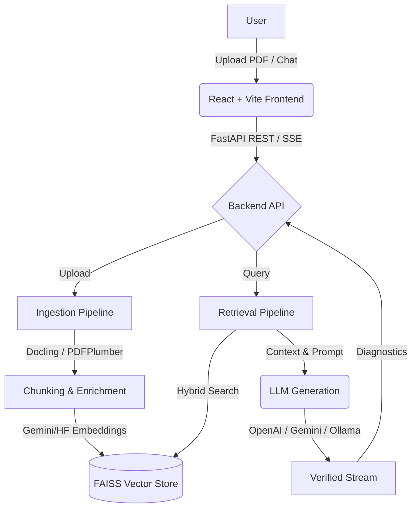

# 🏢 Enterprise RAG Assistant

<div align="center">
  
  
  
  
  
</div>

<br/>

Enterprise-focused **Retrieval-Augmented Generation (RAG)** assistant for PDF knowledge bases. Designed for grounded answers, transparent diagnostics, and practical local/cloud deployment matched with a stunning modern web UI.

---

## ✨ Features

- **📄 Robust Document Ingestion**: Multi-file PDF upload with duplicate detection. Supported parsing via standard `pdfplumber` or advanced `Docling` parsing for complex tables and vision.
- **🔍 Hybrid Retrieval**: Fuses semantic vector search with lexical (BM25-style) capabilities, gated by optional neural reranking (FlagEmbedding) for hyper-accurate context fetching.
- **🧠 Flexible AI Routing**: Plug-and-play LLM/Embedding routing supporting **Gemini**, **OpenAI**, and local **Ollama** or **HuggingFace** models.
- **⚡ Streaming Responses**: Real-time token streaming over Server-Sent Events (SSE) with robust markdown rendering on the frontend.
- **🛡️ Verifiable Answers**: Post-generation verification checking output claims securely against retrieved citations.
- **🎨 Modern View**: Beautiful, modern React application boasting responsive design and glassmorphic aesthetic elements.

## 🏗️ Architecture



## 🛠️ Tech Stack

- **Backend:** FastAPI, LangChain, FAISS, PyPDF/Docling
- **AI/Models:** Google Gemini, OpenAI, HuggingFace (`sentence-transformers`), Ollama
- **Frontend:** React 18, TypeScript, Vite
- **Infrastructure:** Local Filesystem (`data/`) + FAISS index persistence

## 🚀 Getting Started

### Prerequisites

- **Python 3.10+** (3.11 recommended)
- **Node.js 18+** & npm 9+
- *Optional:* NVIDIA GPU + CUDA for faster local embeddings.
- *Optional:* API keys for Gemini (`GEMINI_API_KEY`) or OpenAI (`OPENAI_API_KEY`).

### 1. Backend Setup

From the repository root, create and activate a virtual environment:

```powershell
python -m venv .venv
.\.venv\Scripts\Activate.ps1
```

Install dependencies:
```powershell
python -m pip install --upgrade pip
python -m pip install -r .\backend\requirements.txt
```

Initialize your configuration:
```powershell
Copy-Item .\backend\.env.example .\backend\.env
```
*(Edit `.env` to add your relevant API keys and model selections)*

Start the backend server:
```powershell
cd .\backend
python -m uvicorn app.main:app --reload --port 8000
```

### 2. Frontend Setup

In a new terminal, navigate to the frontend directory:

```powershell
cd .\frontend
npm install
npm run dev
```

Your app should now be running at `http://localhost:5173/` with the API automatically pointing to `http://localhost:8000/`.

---

## ⚙️ Configuration Guide

All core settings are exposed via environment variables in `backend/.env` and controlled by `backend/app/config.py`:

| Variable | Description |
|---|---|
| `EMBEDDING_MODEL` | Model used for vectorization (e.g., `models/text-embedding-004`, `all-MiniLM-L6-v2`) |
| `EMBEDDING_DEVICE` | `auto`, `cpu`, or `cuda` for local HF embeddings |
| `USE_OPENAI` / `USE_GEMINI` | Flags to toggle specific generation engines or local fallback |
| `LLM_MAX_TOKENS` | Maximum token limit for generated responses |
| `ENABLE_NEURAL_RERANKER` | Toggle cross-encoder reranking over retrieved results for higher accuracy |
| `ENABLE_VERIFICATION` | Triggers LLM sanity-check of its output against context chunks |

---

## 📡 API Endpoints

### Knowledge Base
- `POST /upload` - Ingest multiple PDF documents.
- `GET /knowledge-base/files` - List active indexed documents and metadata.
- `POST /knowledge-base/reset` - Clear the library and flush FAISS artifacts.

### Query & Generation
- `POST /query` - Perform standard full-block Q&A.
- `POST /query/stream` - SSE stream endpoint for real-time incremental tokens (`chunk`, `done`, `error` lifecycle).

---

## 🩺 Troubleshooting

- **Backend environment isolated?** Ensure your `uvicorn` process is executing strictly within the active `.venv` to prevent module-not-found errors.
- **FAISS NumPy warnings?** The project pins `numpy==1.26.4` specifically to dodge `faiss-cpu` ABI collisions with newer NumPy 2.x releases.
- **CUDA fallback?** If you enable `EMBEDDING_DEVICE=cuda` but see CPU warnings, verify that the CUDA-enabled `pytorch` wheel is correctly loaded in your virtual environment.

## 📄 License & Status

Developed as an Enterprise RAG Assistant codebase. Currently utilizing local filesystem persistence for ease of deployment.