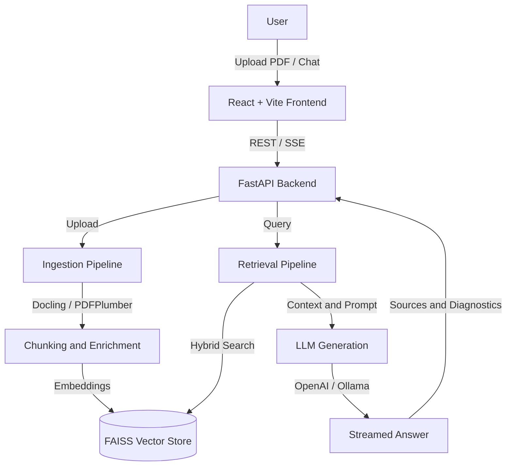

# RAGiT (RAG Assistant)

Retrieval-Augmented Generation assistant for local knowledge bases. It lets you upload PDFs, index their contents, ask grounded questions, stream responses, and inspect retrieved source context.

## Features

- Multi-file PDF upload with duplicate detection.
- Safer upload handling with simple filename validation, PDF byte checks, and configurable upload size limits.
- Hybrid retrieval over FAISS-backed vectors plus lexical/BM25-style signals.
- Optional neural reranking with FlagEmbedding.
- Local-first generation through Ollama, with optional OpenAI generation.
- Server-Sent Events (SSE) streaming for chat responses.
- Source references, confidence diagnostics, and optional post-generation verification.
- React + Vite frontend for background upload jobs, chat history, document management, source chunk review, feedback, reset, and retrieved-context review.
- Per-document delete/reindex operations for local FAISS maintenance.
- SQLite metadata store for document registry, answer feedback, and admin/debug summaries.
- Runtime model health checks for embeddings, Docling, reranker, Ollama, and OpenAI config.
- RAG eval fixture, background eval runs, dashboard, and CI workflow for regression checks.
- Local sample document generator for repeatable demos.
- Local user authentication, admin/user roles, document-level visibility, and audit logs.
- Optional API-key protection for scripts and system-admin access.

## Architecture



## Tech Stack

- Backend: FastAPI, LangChain, FAISS, pdfplumber, Docling
- AI/models: Ollama, OpenAI, HuggingFace sentence-transformers
- Frontend: React, TypeScript, Vite
- Storage: local filesystem uploads and FAISS index persistence
- Metadata: SQLite document registry and feedback store

## Backend Setup

From the repository root:

```powershell
python -m venv .venv
.\.venv\Scripts\Activate.ps1
python -m pip install --upgrade pip
python -m pip install -r .\backend\requirements.txt
Copy-Item .\backend\.env.example .\backend\.env
```

Edit `backend/.env` for your local models and keys, then start the API:

```powershell
cd .\backend
python -m uvicorn app.main:app --reload --port 8000
```

## Frontend Setup

In a separate terminal:

```powershell
cd .\frontend
npm install
npm run dev
```

The frontend defaults to `http://localhost:8000` for the API and runs at `http://localhost:5173/`.

## Convenience Scripts

From the repository root:

```powershell
.\scripts\start_backend.ps1
.\scripts\start_frontend.ps1
.\scripts\run_checks.ps1
```

To export the FastAPI OpenAPI schema:

```powershell
.\scripts\export_openapi.ps1
```

## Authentication Setup

User auth is enabled by default. On first launch, open the frontend and create the first admin account. After that, users sign in with email/password and the frontend sends a bearer token to the backend.

Relevant settings:

```env
ENABLE_USER_AUTH=true
AUTH_TOKEN_TTL_HOURS=24
```

Documents can be marked `shared` or `private` from the sidebar. Admin users can manage all documents; regular users can manage their own documents and only retrieve documents their account can access.

## API Key Setup

For local browser use, `APP_API_KEY` can be left empty because login tokens protect the app.

For scripts, CI, or production-like system-admin access:

```env
APP_ENV=production
APP_API_KEY=replace-with-a-long-random-secret
ALLOWED_CORS_ORIGINS=https://your-frontend.example.com
```

Set the same value in the frontend environment:

```env
VITE_API_KEY=replace-with-a-long-random-secret
```

When `APP_ENV=production`, the backend fails startup if `APP_API_KEY` is empty.

## Public Resume Demo Deployment

This repo includes a Render blueprint (`render.yaml`) and Vercel config (`frontend/vercel.json`) for a public showcase deployment.

Backend on Render:

```env
APP_ENV=production
APP_API_KEY=replace-with-a-long-random-admin-secret
PUBLIC_DEMO_MODE=true
USE_OPENAI=true
OPENAI_API_KEY=sk-...
OPENAI_MODEL=gpt-5.4-mini
ALLOWED_CORS_ORIGINS=https://your-vercel-app.vercel.app
ENABLE_DOCLING=false
ENABLE_VISION_ENRICHMENT=false
ENABLE_SUMMARY=false
ENABLE_NEURAL_RERANKER=false
```

Frontend on Vercel:

```env
VITE_API_URL=https://your-render-service.onrender.com
VITE_PUBLIC_DEMO_MODE=true
```

Do not set `VITE_API_KEY` for the public demo. The frontend sends an anonymous `X-Demo-Session-Id`; the backend enforces public upload/query quotas and keeps admin operations behind login or `APP_API_KEY`.

After the backend is live, seed the curated PDFs so visitors can try the app immediately:

```powershell
.\scripts\seed_sample_docs.ps1 -ApiUrl https://your-render-service.onrender.com -ApiKey <APP_API_KEY>
```

## Important Configuration

| Variable | Description |
|---|---|
| `APP_ENV` | `development` or `production`. Production requires `APP_API_KEY`. |
| `APP_API_KEY` | Optional local API key; required in production. |
| `ENABLE_USER_AUTH` | Enables local email/password login and bearer-token auth. |
| `AUTH_TOKEN_TTL_HOURS` | Login token lifetime in hours. |
| `ALLOWED_CORS_ORIGINS` | Comma-separated frontend origins allowed by CORS. |
| `MAX_UPLOAD_SIZE_MB` | Maximum PDF upload size handled by the app. |
| `METADATA_DB_PATH` | SQLite store for document registry, feedback, and admin summaries. |
| `PUBLIC_DEMO_MODE` | Enables anonymous public demo access with session isolation and quotas. |
| `DEMO_MAX_UPLOAD_MB` | Maximum PDF size for anonymous demo uploads. |
| `DEMO_MAX_PAGES` | Maximum PDF page count for anonymous demo uploads. |
| `DEMO_MAX_FILES_PER_REQUEST` | Maximum files per anonymous demo upload request. |
| `DEMO_MAX_DOCS_PER_SESSION` | Maximum live uploaded documents per anonymous demo session. |
| `DEMO_UPLOADS_PER_HOUR` | Anonymous upload requests allowed per session per hour. |
| `DEMO_QUERIES_PER_HOUR` | Anonymous query requests allowed per session per hour. |
| `EMBEDDING_MODEL` | Local sentence-transformers embedding model. |
| `EMBEDDING_DEVICE` | Embedding runtime device. Use `cpu`, `auto`, `cuda`, or `cuda:<index>` when CUDA-enabled PyTorch is available. |
| `USE_OPENAI` | Route generation through OpenAI when enabled. |
| `OPENAI_API_KEY` | OpenAI key for generation, summaries, or vision enrichment. |
| `OPENAI_FALLBACK_TO_LOCAL` | Optional local Ollama fallback when OpenAI generation fails. Keep `false` to use OpenAI only. |
| `LOCAL_LLM_ENDPOINT` | Ollama generation endpoint. |
| `LOCAL_LLM_MODEL` | Ollama model tag for local generation. |
| `ENABLE_NEURAL_RERANKER` | Enables cross-encoder reranking. |
| `RERANKER_MODEL_NAME` | Local cross-encoder model used by FlagEmbedding. |
| `ENABLE_DOCLING` | Enables structured PDF parsing before the legacy parser fallback. |
| `ENABLE_VERIFICATION` | Enables lightweight post-generation verification. |

## API Endpoints

- `GET /health` - public health check.
- `GET /auth/status` - inspect whether first-admin bootstrap is required.
- `POST /auth/bootstrap` - create the first admin account.
- `POST /auth/login` - exchange email/password for a bearer token.
- `POST /auth/logout` - revoke the current bearer token.
- `GET /auth/me` - return the current user.
- `GET /auth/users` - list users as an admin.
- `POST /auth/users` - create a user as an admin.
- `POST /upload` - ingest one or more PDF documents.
- `POST /upload/jobs` - upload PDFs and ingest them in the background.
- `GET /upload/jobs/{job_id}` - poll ingestion job progress.
- `GET /knowledge-base/files` - list indexed document metadata.
- `GET /knowledge-base/files/{file_hash}/chunks` - inspect stored chunks for a document.
- `PATCH /knowledge-base/files/{file_hash}/permissions` - update document visibility.
- `DELETE /knowledge-base/files/{file_hash}` - remove one document from uploads, registry, and FAISS.
- `POST /knowledge-base/files/{file_hash}/reindex` - rebuild chunks/vectors for one stored PDF.
- `POST /knowledge-base/reset` - clear uploads and FAISS artifacts.
- `POST /query` - run a non-streaming RAG query.
- `POST /query/stream` - stream RAG output using SSE events.
- `POST /feedback` - record answer feedback.
- `GET /chat/sessions` - list saved chat sessions.
- `POST /chat/sessions` - create a saved chat session.
- `GET /chat/sessions/{session_id}/messages` - load chat history.
- `POST /chat/sessions/{session_id}/messages` - store a chat message.
- `POST /evals/runs` - start a background eval run.
- `GET /evals/runs` - list eval runs for the dashboard.
- `GET /admin/overview` - local admin/debug summary.
- `GET /admin/audit-log` - list recent audit events.
- `GET /health/models` - runtime model/dependency health check.

Protected endpoints require either a login bearer token or `X-API-Key`. The API key path acts as a system-admin path for automation.

## Verification

Frontend:

```powershell
cd .\frontend
npm run lint
npm run build
```

Backend:

```powershell
$env:PYTHONPATH='backend'
python -m unittest discover -s backend\tests
python -m compileall backend\app
```

RAG eval dry run:

```powershell
python .\evals\run_eval.py
```

RAG eval against a running backend:

```powershell
python .\evals\run_eval.py --live --api-url http://localhost:8000
```

If user auth is enabled, configure `APP_API_KEY` for eval automation and pass it to the script:

```powershell
python .\evals\run_eval.py --live --api-url http://localhost:8000 --api-key replace-with-a-long-random-secret
```

Update `evals/questions.json` with expected source filenames/pages after indexing your own sample PDFs.

## Sample Knowledge Pack

Generate sample PDFs:

```powershell
python .\sample_docs\generate_sample_pdfs.py
```

Upload the generated PDFs from `sample_docs/` through the UI. The eval fixture already contains expected source pages for these files:

- `Employee_Handbook.pdf`
- `Vendor_Onboarding_Guide.pdf`
- `SLA_Support_Process.pdf`
- `Security_Access_Control_Policy.pdf`

Then run:

```powershell
python .\evals\run_eval.py --live --api-url http://localhost:8000
```

## Notes

- The FAISS index is local to the configured embedding model path. Changing embedding models creates a separate index namespace.
- FAISS local loading uses LangChain's deserialization support. Keep the FAISS index directory trusted and do not let untrusted users write arbitrary files into it.
- For externally exposed deployments, also enforce upload limits at the proxy/server layer so oversized requests are rejected before the app reads the full body.
